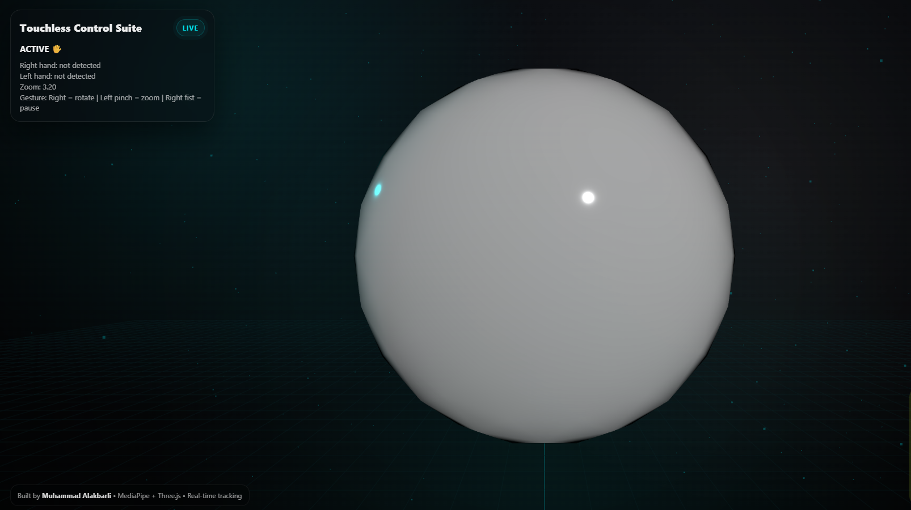

# Touchless Control Suite 🎯

A real-time **gesture-based 3D UI demo** built with **MediaPipe Hands + Three.js**.

Control a 3D object without touching your mouse:
- **Right hand** → Rotate  
- **Left hand (pinch)** → Zoom  
- **Right fist** → Pause / Resume  

This project is designed for **Human-Computer Interaction (HCI)**, accessibility experiments, and portfolio-grade computer vision demos.

---

## 🚀 Live Demo (GitHub Pages)

👉 https://muhammedalakbarli.github.io/touchless-control-suite/

> ⚠️ Note: Camera access is required.  
> Works best on **Chrome Desktop**.

---

## ✨ Features

- ✅ Real-time hand tracking with **MediaPipe**
- ✅ Two-hand support (right + left)
- ✅ Smooth 3D rotation & zoom
- ✅ Gesture UI overlay (hand landmarks)
- ✅ Pause / resume mode (fist gesture)
- ✅ Clean “HUD-style” interface
- ✅ Fully static deploy (works on GitHub Pages)

---

## 🎮 Controls

| Gesture | Hand | Action |
|--------|------|--------|
| Open hand detected | Right | Rotate object |
| Pinch (thumb + index) | Left | Zoom in/out |
| Fist | Right | Pause / Resume |

---

## 🧠 Tech Stack

- **MediaPipe Hands** (Google)
- **Three.js**
- Vanilla JavaScript (ES Modules)
- HTML + CSS (HUD / UI design)
- GitHub Pages deployment

---

## 🖼️ Preview

### Main UI

